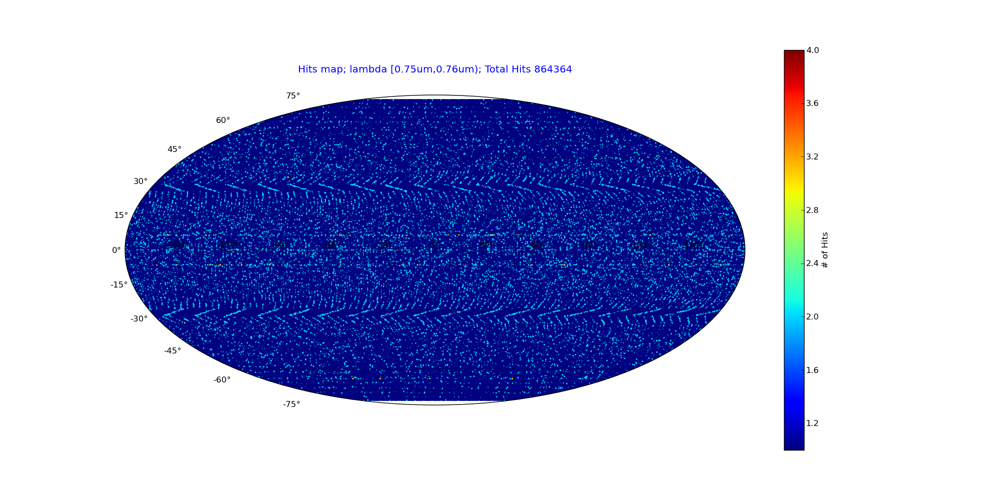

=========
skymapper
=========

**skymapper** is a tool for visualization and analysis of all-sky and 
deep sky scans built on python's Numpy and Matplotlib libraries.

   Mollweide Projection of all-sky scan hits map for small wavelength range

:Date: 2014-10-8
:Version: 1.0.0
:Authors: Raj Katti

Dependencies
------------

1) **Numpy**
The standard python module for scientific computing: http://www.numpy.org/

2) **Matplotlib**
The standard python module for data visualization: http://matplotlib.org/
