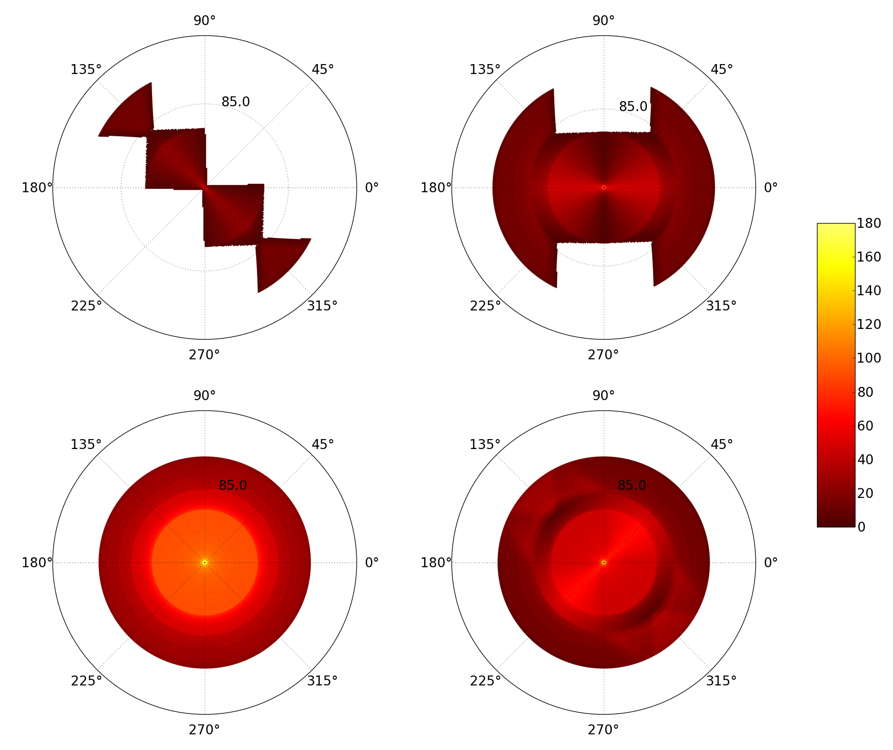

=========
skymapper
=========

.. |fnL| replace:: f\ :sub:`nL` 

*\ skymapper*\  is a Python package designed to define, visualize and analyze 
all-sky and deep-sky surveys for SPHEREx, 
an Earth-orbiting spectrophotometer in development at 
Caltech/Jet Propulsion Laboratory. 

**Fig 1)** Least Hits Maps of the one-year evolution of the SPHEREx Deep-Sky 
Survey.
Clockwise from upper left: Day 91, Day 183, Day 273, 1 Year.
Least hits maps color each sky pixel by the least number of times it
was viewed over all wavelengths of the spectrophotometer 
(see "What is skymapper?" section for more details). 
All plots are looking down on the north celestial pole.  
 
What is SPHEREx?
----------------
**SPHEREx** stands for **S**\ pectro\ **P**\ hotometer for the **H**\ istory of 
the Universe, **E**\ poch of **R**\ eionization, and Ices **Ex**\ plorer.
Over its two-year mission, SPHEREx will create two near-infared 
sky surveys to address NASA's three major astrophysics goals:

* **Probe the origin and destiny of our universe**

SPHEREx seeks to describe the nature of cosmic inflation, the theorized phase of
of accelerated expansion in the early universe. The mission will produce a 
catalog of low-redshift galaxies to calculate non-Gaussianity in the 
distribution of matter in the universe. Ultimately, these results will be used 
to estimate the so-called |fnL| parameter. 
|fnL| > 1 would suggest that several fundamental fields drove inflation, while
|fnL| < 1 would suggest that a single fundamental field drove inflation. 
Either result will be a major advance in current understanding of the 
physical universe.  

* **Explore the origin and evolution of galaxies**

To probe galaxy formation, SPHEREx will map fluctuations in emission line 
intensity as a function of redshift (and therefore time). Since emission 
line intensity traces 
the distribution of matter in the universe, this intensity mapping 
techinque exploits the 
large-volume SPHEREx survey to give clustering
information about faint galaxies. By observing at several wavelengths, SPHEREx 
will map the intensity fluctuations of several spectral lines as a function of 
redshift. The work will culminate in robust estimates of the rate galaxy of
formation.

* **Discover and study planets around other stars, and explore whether they could harbor life**

Star formation occurs in dense interstellar clouds of dust and ice. 
It has been hypothesized that water in our solar system is primarily due 
to interstellar
ice with minimal processing in the pre-solar disk. This remains an open
question due to the small number of samples taken of ice abundance. SPHEREx
will remedy this by increasing the number of samples of galactice ice absorption 
by 1000 times.

What is **skymapper**?
-----------------------

The SPHEREx mission relies on two surveys, a low-redundancy large-area 
"all-sky" survey and a high-redundancy "deep-sky" survey about the 
celestial poles.
*\ skymapper*\  was created to define, analyze, and visualize scan strategies to achieve
these two surveys. Coverage maps generated using *\ skymapper*\  will be 
published in the SPHEREx proposal in December 2014 (see Citation 1).

.. figure:: ./_build/allsky2_complete_1.png
   :align:  center
   :alt: All Sky scan
   :figclass: align-center

.. class:: center
**Fig 2)** Hits Map of All-Sky Scan for Wavelength Range [.75um, .76um] (Mollweide Projection)

The SPHEREx spectrophotometer consists of near-IR detector arrays covered 
by rectangular linear variable filters (LVFs). To good approximation, the LVFs
are divided into equal-area "stripes" of constant wavelength. They are 
joined along their dispersion direction to produce a single rectangular 
field-of-view (FOV) comprised of multiple wavelength strips. 
Since there are no moving parts associated with
the spectrophotometer, sky coverage is achieved by strategically pointing 
the spacecraft in desired directions.

** skymapper Capabilities:**

| Discretizes the sky into equal-area iso-latitude "sky pixels" defined by 
  the HEALPIX algorithm. 
|
| Generates and/or reads in a list of pointing directions
  parametrized by the polar, azimuthal, and axial angles of the axis passing 
  through the center of Earth and the center of the FOV. 
|
| For each pointing, records the sky pixel 
  coordinates observed at each wavelength of the FOV 
  using an efficient Pandas dataframe and
  NumPy methods. 
|
| Produces a figure-of-merit associated with the efficiency and effective 
  area of the scan.

|* Generates redundancy maps, a.k.a. "hits maps",
at desired wavelength ranges, with sky pixels colored
according to the redundancy of the survey in that wavelength range. 

|* Generates **least-hits coverage maps** (Fig. 1), in which  each sky pixel is colored 
corresponding to the
least number of hits for all wavelengths, i.e. if a pixel is missed at
any wavlength it not be colored, if it is seen at least once at all wavelengths 
it will be colored corresponding to "1", etc. A least-hits coverage map 
corresponds to a scan's minimum coverage for all wavelengths.

|* Deep-sky scans (Fig. 1) are plotted as polar plots about the celestial pole (survey is symmetric for North and 
South celestial poles). 

|* All-sky scans (Fig. 2) are plotted on Mollweide full-sky projections. 

Version Information
--------------------

:Date: 2014-11-16
:Version: 1.0.0
:Authors: Raj Katti
:Contact: rmkatti@gmail.com

Dependencies
------------

1) **Numpy**

The standard Python library for numerical computing: http://www.numpy.org/

2) **Pandas**

Python library providing high performance data structures and data analysis tools: http://pandas.pydata.org/

3) **Matplotlib**

The standard Python library for data visualization: http://matplotlib.org/

4) **Healpy**

Python implementation of the HEALPIX algorithm. Useful for discretizing the sky
in CMB- and astronomy-related work: 

* HEALPIX: http://healpix.jpl.nasa.gov/
* healpy documentation: http://healpy.readthedocs.org/en/latest/

Citations
------------

Bock, J.J. et al. In Press. *\ SPHEREx: An All-Sky Spectral Survey*\ .
California Institute of Technology, Pasadena.
